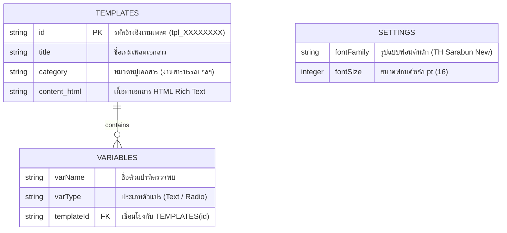

# 🛠️ คู่มือนักพัฒนาและสถาปัตยกรรมระบบ (Developer Guide)

เอกสารนี้รวบรวมรายละเอียดทางเทคนิค สถาปัตยกรรมซอฟต์แวร์ API Specifications และโครงสร้าง OOXML ของระบบ **Draft2Desk**

---

## 🏗️ 1. สถาปัตยกรรมระบบ (System Architecture)

Draft2Desk ออกแบบตามสถาปัตยกรรม Decoupled Web Add-in 3 เลเยอร์:

```text
+-------------------------------------------------------------+
|                Microsoft Word (Host Client)                 |
|  [Office.js SDK] <---> [Selection / OOXML Coercion API]     |
+-------------------------------------------------------------+
                              ▲
                              │ HTTP / Static File Serving
                              ▼
+-------------------------------------------------------------+
|                Frontend Layer (Vanilla Web Stack)            |
|  - index.html (Single Page App Layout)                      |
|  - style.css (Dark Mode Design Tokens & CSS Grid/Flexbox)    |
|  - app.js (CRUD Operations, Variables Drawer, Settings)      |
|  - office-helper.js (DOM-to-OOXML Parser & VML Packager)     |
+-------------------------------------------------------------+
                              ▲
                              │ REST APIs (JSON)
                              ▼
+-------------------------------------------------------------+
|                Backend Layer (Python FastAPI)               |
|  - main.py (FastAPI App & Static Directory Mounting)        |
|  - database.py (SQLite Connection & Table Initialization)   |
|  - models.py (Pydantic Validation & Regex Placeholders)     |
|  - routers/templates.py (RESTful API Endpoints)              |
+-------------------------------------------------------------+
                              ▲
                              │ SQL
                              ▼
+-------------------------------------------------------------+
|                Database Layer (SQLite3)                     |
|  - draft2desk.db (Table: templates)                         |
+-------------------------------------------------------------+
```

---

## 🗄️ 2. ER-Diagram & Data Dictionary (พจนานุกรมข้อมูล)

### 📊 ER-Diagram (Entity-Relationship Diagram)


### 📋 Data Dictionary (พจนานุกรมข้อมูล)

#### 1. ตาราง `templates` (ฐานข้อมูล SQLite: `draft2desk.db`)
| คอลัมน์ (Column) | ชนิดข้อมูล (Type) | Nullable | Primary Key | คำอธิบาย (Description) |
| :--- | :--- | :--- | :--- | :--- |
| **`id`** | TEXT | NO | YES | รหัสระบุเทมเพลตเฉพาะ สุ่มด้วย UUID 8 ตัวอักษรขึ้นต้นด้วย `tpl_` |
| **`title`** | TEXT | NO | NO | ชื่อหัวข้อร่างเทมเพลตเอกสาร (เช่น *บันทึกเสนอขออนุมัติหลักการ*) |
| **`category`** | TEXT | NO | NO | หมวดหมู่เอกสาร (เช่น *งานสารบรรณ*, *งานบุคคล*, *งานจัดซื้อจัดจ้าง*) |
| **`content_html`** | TEXT | NO | NO | เนื้อหาเอกสารในรูปแบบ HTML Rich Text รวมถึงตัวแปร `{{...}}` |

#### 2. โครงสร้าง `settings` (การตั้งค่าฟอนต์ & ไฟล์สำรองข้อมูล)
| ฟิลด์ (Field) | ชนิดข้อมูล (Type) | ค่าเริ่มต้น (Default) | คำอธิบาย (Description) |
| :--- | :--- | :--- | :--- |
| **`fontFamily`** | STRING | `"TH Sarabun New"` | ชื่อฟอนต์หลักมาตรฐาน ใช้สร้างแท็ก `<w:rFonts>` ใน OOXML |
| **`fontSize`** | INTEGER | `16` | ขนาดฟอนต์หลัก (pt) ใช้คำนวณแท็ก `<w:sz>` ใน OOXML |

#### 3. โครงสร้างตัวแปร `variables` (Dynamic Parser Schema)
| รูปแบบตัวแปร | ชนิดข้อมูล | รูปแบบ Regex | พฤติกรรมในเอกสาร Word |
| :--- | :--- | :--- | :--- |
| **Text Variable** | ข้อความ | `\{\{\s*([^{}]+?)\s*\}\}` | สร้างช่องพิมพ์ข้อความ และนำค่าที่พิมพ์แทรกลงในเอกสาร |
| **Radio Variable** | ปุ่มวิทยุ | `\{\{\s*opt:([^{}]+?)\s*\}\}` | สร้างปุ่มเลือก `🔘 มี` ➔ แทรกคำนั้น / `⚪ ไม่มี` ➔ ไม่แทรกคำนั้น |

---

## 📡 2. REST API Endpoints Specification

Base URL: `/api/v1/templates`

### 1. List Templates
* **GET** `/api/v1/templates`
* **Response `200 OK`**:
```json
[
  {
    "id": "tpl-12345",
    "title": "บันทึกเสนอขออนุมัติหลักการ",
    "category": "บันทึกข้อความ",
    "content_html": "เรียน {{ผู้รับ}}<br>&nbsp;&nbsp;&nbsp;&nbsp;&nbsp;&nbsp;&nbsp;&nbsp;เรื่อง {{เรื่อง}}",
    "variables": ["ผู้รับ", "เรื่อง"]
  }
]
```

### 2. Get Single Template
* **GET** `/api/v1/templates/{id}`
* **Response `200 OK`**: `TemplateResponse` Object
* **Response `404 Not Found`**: `{"detail": "Template not found"}`

### 3. Create Template
* **POST** `/api/v1/templates`
* **Request Body**:
```json
{
  "title": "คำสั่งแต่งตั้งคณะทำงาน",
  "category": "คำสั่ง",
  "content_html": "คำสั่งกรมเรื่อง {{เรื่อง}}<br>สั่ง ณ วันที่ {{วันที่}}"
}
```
* **Response `200 OK`**: Created `TemplateResponse` with auto-parsed `variables`.

### 4. Update Template
* **PUT** `/api/v1/templates/{id}`
* **Request Body**: `TemplateCreate` Object

### 5. Delete Single Template
* **DELETE** `/api/v1/templates/{id}`
* **Response `204 No Content`**

### 6. Clear All Templates (Bulk Wipe for Restore)
* **DELETE** `/api/v1/templates`
* **Response `200 OK`**: `{"message": "All templates cleared successfully"}`

---

## 📄 3. OOXML & VML Technical Specification

เพื่อแทรกกล่องข้อความลอยแบบโปร่งใส ไม่มีขอบ และยืดหยุ่นใน MS Word ผ่าน `Office.js` `insertOoxml`:

### Flat OPC Package Wrapper:
```xml
<?xml version="1.0" encoding="UTF-8" standalone="yes"?>
<pkg:package xmlns:pkg="http://schemas.microsoft.com/office/2006/xmlPackage">
  <pkg:part pkg:name="/_rels/.rels" pkg:contentType="application/vnd.openxmlformats-package.relationships+xml" pkg:padding="512">
    <pkg:xmlData>
      <Relationships xmlns="http://schemas.openxmlformats.org/package/2006/relationships">
        <Relationship Id="rId1" Type="http://schemas.openxmlformats.org/officeDocument/2006/relationships/officeDocument" Target="word/document.xml"/>
      </Relationships>
    </pkg:xmlData>
  </pkg:part>
  <pkg:part pkg:name="/word/document.xml" pkg:contentType="application/vnd.openxmlformats-officedocument.wordprocessingml.document.main+xml">
    <pkg:xmlData>
      <w:document 
        xmlns:w="http://schemas.openxmlformats.org/wordprocessingml/2006/main" 
        xmlns:v="urn:schemas-microsoft-com:vml"
        xmlns:o="urn:schemas-microsoft-com:office:office">
        <w:body>
          <w:p>
            <w:r>
              <w:pict>
                <!-- VML Shape: position:absolute (floating), filled="f" (transparent), stroked="f" (borderless) -->
                <v:rect style="position:absolute;margin-left:0pt;margin-top:0pt;width:400pt;height:250pt;z-index:251659264;v-text-anchor:top" filled="f" stroked="f">
                  <v:textbox style="mso-fit-shape-to-text:t;">
                    <w:txbxContent>
                      <w:p>
                        <w:pPr><w:ind w:left="720"/></w:pPr>
                        <w:r>
                          <w:rPr>
                            <w:rFonts w:ascii="TH Sarabun New" w:hAnsi="TH Sarabun New" w:cs="TH Sarabun New"/>
                            <w:sz w:val="32"/>
                            <w:szCs w:val="32"/>
                            <w:b/>
                          </w:rPr>
                          <w:t xml:space="preserve">ข้อความทดสอบ</w:t>
                        </w:r>
                      </w:p>
                    </w:txbxContent>
                  </v:textbox>
                </v:rect>
              </w:pict>
            </w:r>
          </w:p>
        </w:body>
      </w:document>
    </pkg:xmlData>
  </pkg:part>
</pkg:package>
```

### Key Parameters:
* **Font Family:** `<w:rFonts w:ascii="TH Sarabun New" w:hAnsi="TH Sarabun New" w:cs="TH Sarabun New"/>`
* **Font Size (Half-Points):** `<w:sz w:val="32"/>` (32 = 16pt)
* **Left Indent (Twips):** `<w:ind w:left="720"/>` (720 twips = 0.5 inch / ~8 spaces)
* **Auto-fit Height:** `style="mso-fit-shape-to-text:t;"`

---

## 🗄️ 4. Database Schema (SQLite)

```sql
CREATE TABLE IF NOT EXISTS templates (
    id TEXT PRIMARY KEY,
    title TEXT NOT NULL,
    category TEXT NOT NULL,
    content_html TEXT NOT NULL
);
```

---

## 📦 5. Building Executables & Enterprise Installers (.msi / .pkg)

### 1. คอมไพล์ Standalone Backend Server (PyInstaller):
```bash
python scripts/build_exe.py
```
สคริปต์จะสร้างโฟลเดอร์ `dist/Draft2DeskServer/` บรรจุ Executable และ Static Web Assets ที่สามารถรันได้ทันทีโดยไม่ต้องลง Python ในเครื่องลูก

### 2. ข้อกำหนดสถาปัตยกรรมตัวติดตั้ง (.msi / .pkg):
* **Packaging:** บรรจุ `Draft2DeskServer` executable ไว้ข้างในไฟล์ติดตั้ง
* **Auto-Start Registration:**
  * **Windows:** ลงทะเบียน Windows Service หรือ Startup Registry
  * **macOS:** คัดลอก LaunchAgent `.plist` ไปยัง `~/Library/LaunchAgents/`
* **Word Manifest Auto-Sideloading:**
  * **Windows:** คัดลอก `manifest.xml` ไปยัง `%APPDATA%\Microsoft\Word\AddIns` และตั้งค่า Registry Key `HKCU\Software\Microsoft\Office\16.0\Word\Security\Trusted Catalogs\Draft2Desk` (`Flags = 1`)
  * **macOS:** คัดลอก `manifest.xml` ไปยัง `~/Library/Containers/com.microsoft.Word/Data/Documents/wef/`
* **Uninstaller Lifecycle:**
  * สคริปต์ถอนการติดตั้งต้องแสดงป็อบอัปถามผู้ใช้: *"ต้องการคงฐานข้อมูลเทมเพลตและค่าตั้งฟอนต์ (`draft2desk.db`) ไว้หรือไม่?"* ก่อนลบไฟล์โปรแกรม

---

## 🔄 6. ขั้นตอนการปรับปรุงและบำรุงรักษาระบบ (Update & Maintenance Workflow)

เมื่อมีการแก้ไขหรือพัฒนาฟีเจอร์ใหม่ในอนาคต ให้นักพัฒนาดำเนินการตาม 4 ขั้นตอนดังนี้:

### 1. การแก้ไขโค้ดและทดสอบในเครื่อง (Local Development & Testing)
* เปิดรัน FastAPI Backend Server ในโหมด Auto-reload:
  ```bash
  source .venv/bin/activate
  uvicorn backend.main:app --reload --host 127.0.0.1 --port 8000
  ```
* ทดสอบหน้าตา Taskpane ผ่านเบราว์เซอร์ที่ `http://127.0.0.1:8000` หรือเปิดทดสอบใน MS Word

### 2. การอัปเดตเลขเวอร์ชันและประวัติการแก้ไข (Versioning & Changelog)
* หากมีการปรับสิทธิ์หรือโครงสร้าง Manifest ให้เปลี่ยนเลขเวอร์ชันใน `manifest.xml` (เช่น `<Version>1.0.2</Version>`)
* บันทึกรายละเอียดสิ่งที่ปรับปรุงเพิ่มลงในเอกสาร [docs/CHANGELOG.md](CHANGELOG.md)

### 3. ตรวจสอบไวยากรณ์และนำส่งโค้ดขึ้น Git (Syntax Check & Git Push)
* ตรวจสอบไวยากรณ์ Python:
  ```bash
  python3 -m py_compile backend/routers/templates.py backend/database.py backend/main.py
  ```
* Commit และ Push ขึ้นสู่ GitHub Repository:
  ```bash
  git add .
  git commit -m "รายละเอียดสิ่งที่ปรับปรุงแก้ไข..."
  git push origin main
  ```

### 4. การส่งมอบตัวอัปเดตให้ผู้ใช้งาน (Distributing Updates)
* **กรณีใช้ 1-Click Script (`install_mac.command` / `install_win.bat`):** ให้ผู้ใช้ดึงโค้ดใหม่ (`git pull`) แล้วรันสคริปต์ทับเดิมได้ทันที โดยฐานข้อมูล `draft2desk.db` ไม่สูญหาย
* **กรณีใช้ Installer Package (.msi / .pkg):** รัน `python scripts/build_exe.py` แล้วนำไฟล์ใน `dist/Draft2DeskServer` ไปบิลด์เป็นไฟล์ติดตั้งเวอร์ชันใหม่ส่งมอบให้ผู้ใช้
